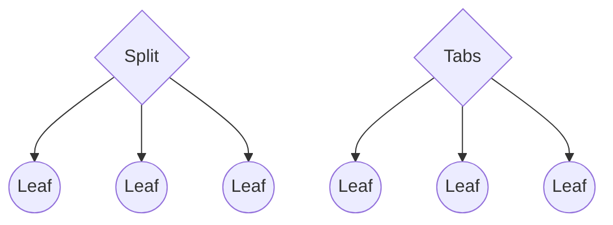
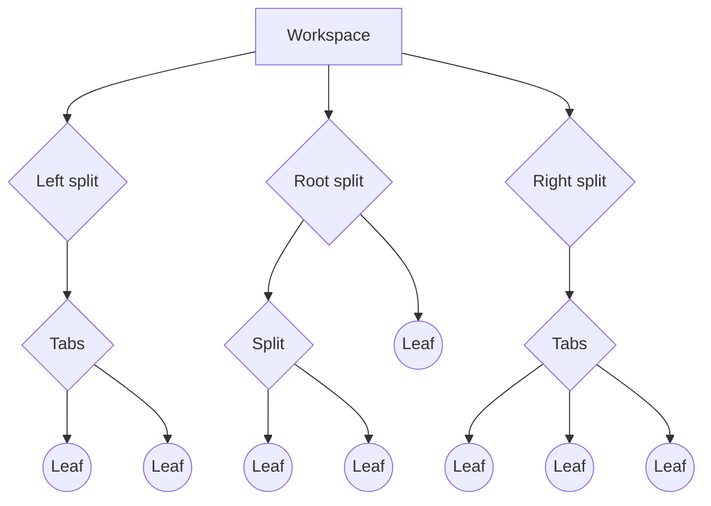
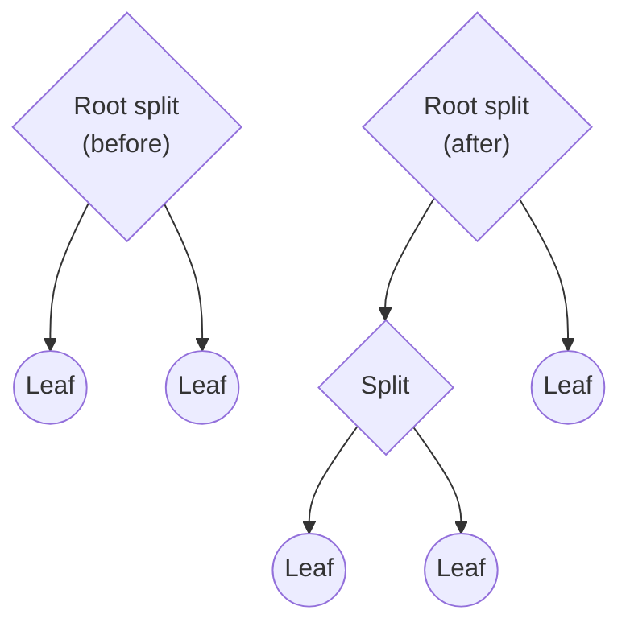
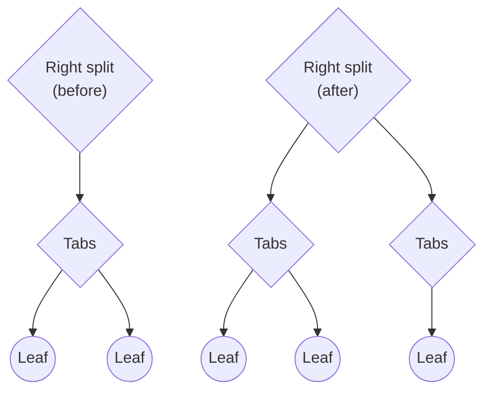

Obsidian은 언제든지 어떤 콘텐츠를 볼 수 있는지 구성할 수 있게 해줍니다. 필요 없을 때 파일 탐색기를 숨기거나, 여러 문서를 나란히 표시하거나, 작업하는 동안 문서의 개요를 표시할 수 있습니다. 애플리케이션 창 내에서 보이는 콘텐츠의 구성을 _작업 공간(workspace)_ 이라고 합니다.

작업 공간은 [트리 데이터 구조](https://en.wikipedia.org/wiki/Tree_(data_structure))로 구현되며, 트리의 각 노드는 [[WorkspaceItem|작업 공간 항목]]이라고 합니다. 작업 공간 항목에는 [[WorkspaceParent|부모]]와 [[WorkspaceLeaf|리프]] 두 가지 유형이 있습니다. 주요 차이점은 부모 항목은 다른 부모 항목을 포함한 _자식_ 항목을 포함할 수 있지만, 리프 항목은 어떤 작업 공간 항목도 포함할 수 없다는 것입니다.

부모 항목에는 [[WorkspaceSplit|분할]]과 [[WorkspaceTabs|탭]] 두 가지 유형이 있으며, 이는 자식이 사용자에게 어떻게 표시되는지를 결정합니다:



- 분할 항목은 자식 항목을 수직 또는 수평 방향으로 차례로 배치합니다.
- 탭 항목은 한 번에 하나의 자식 항목만 표시하고 나머지는 숨깁니다.

작업 공간에는 _왼쪽_, _오른쪽_, _루트_라는 세 가지 특별한 분할 항목이 있습니다. 다음 다이어그램은 일반적인 작업 공간이 어떻게 보일 수 있는지 보여주는 예입니다:



리프는 다양한 방식으로 콘텐츠를 표시할 수 있는 창입니다. 리프의 유형은 콘텐츠가 표시되는 방식을 결정하며, 특정 _뷰_에 해당합니다. 예를 들어, `graph` 유형의 리프는 [그래프 뷰](https://help.obsidian.md/Plugins/Graph+view)를 표시합니다.

## 분할(Splits)

기본적으로 루트 분할의 방향은 수직으로 설정됩니다. 여기에 새 리프를 만들면 Obsidian은 사용자 인터페이스에 새 열을 만듭니다. 리프를 분할하면 결과 리프가 새 분할 항목에 추가됩니다. 루트 분할 아래에 만들 수 있는 수준의 수에는 정의된 제한이 없지만, 실제로는 각 수준마다 유용성이 감소합니다.



왼쪽 및 오른쪽 분할은 약간 다르게 작동합니다. 사이드 도크에서 리프를 분할하면 Obsidian은 새 탭 항목을 생성하고 그 아래에 새 리프를 추가합니다. 사실상, 이는 언제든지 세 가지 수준의 작업 공간 항목만 가질 수 있으며, 모든 직접 자식은 탭 항목이어야 함을 의미합니다.



## 작업 공간 검사하기

[[App|App]] 객체를 통해 작업 공간에 접근할 수 있습니다. 다음 예제는 작업 공간의 모든 리프 유형을 출력합니다:

```ts
import { Plugin } from 'obsidian';

export default class ExamplePlugin extends Plugin {
  async onload() {
    this.addRibbonIcon('dice', 'Print leaf types', () => {
      this.app.workspace.iterateAllLeaves((leaf) => {
        console.log(leaf.getViewState().type);
      });
    });
  }
}
```

## 리프 생명주기

플러그인은 작업 공간에 모든 유형의 리프를 추가할 수 있으며, [[Views|사용자 정의 뷰]]를 통해 새 리프 유형을 정의할 수도 있습니다. 작업 공간에 리프를 추가하는 몇 가지 방법은 다음과 같습니다. 더 많은 방법은 [[Reference/TypeScript API/Workspace|Workspace]]를 참조하세요.

- 루트 분할에 새 리프를 추가하려면 [[getLeaf|getLeaf(true)]]를 사용하세요.
- 사이드바 중 하나에 새 리프를 추가하려면 [[getLeftLeaf|getLeftLeaf()]] 및 [[getRightLeaf|getRightLeaf()]]를 사용하세요. 둘 다 새 분할에 리프를 추가할지 여부를 결정할 수 있습니다.

[[createLeafInParent|createLeafInParent()]]를 사용하여 선택한 분할에 명시적으로 리프를 추가할 수도 있습니다.

명시적으로 제거하지 않는 한, 플러그인이 작업 공간에 추가한 모든 리프는 플러그인이 비활성화된 후에도 남아 있습니다. 플러그인은 작업 공간에 추가한 모든 리프를 제거할 책임이 있습니다.

작업 공간에서 리프를 제거하려면 제거하려는 리프에서 [[detach|detach()]]를 호출하세요. [[detachLeavesOfType|detachLeavesOfType()]]을 사용하여 특정 유형의 모든 리프를 제거할 수도 있습니다.

## 리프 그룹

[[setGroup|setGroup()]]을 사용하여 여러 리프를 동일한 그룹에 할당하여 [연결된 뷰](https://help.obsidian.md/User+interface/Tabs#Linked+views)를 만들 수 있습니다.

```ts
leaves.forEach((leaf) => leaf.setGroup('group1');
