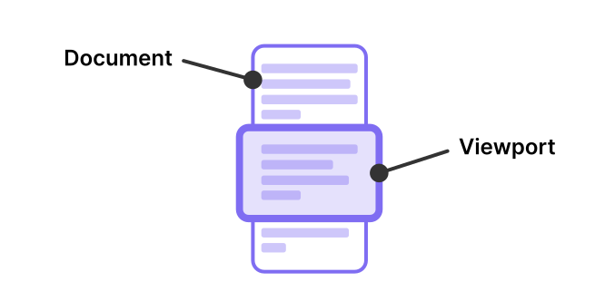

Obsidian 에디터는 수백만 줄에 달하는 [거대한 문서](https://codemirror.net/examples/million/)를 지원합니다. 이것이 가능한 이유 중 하나는 에디터가 현재 보이는 부분(그리고 그 주변 약간)만 렌더링하기 때문입니다.

모니터에 한 번에 담을 수 없을 만큼 큰 문서를 편집한다고 상상해 보세요. Obsidian 에디터는 문서를 가로지르며 움직이는 "창(window)"을 생성하여, 이 창 내부의 콘텐츠만 렌더링하고 창 밖의 내용은 무시합니다. 이 창을 에디터의 _viewport_ 라고 합니다.

사용자가 문서를 스크롤하거나 문서 자체가 변경될 때마다 viewport는 최신 상태가 아니게 되며 재계산이 필요합니다.

viewport에 의존하는 에디터 확장을 만들고 싶다면, [[View plugins]]를 참조하세요.

> [!note]
> 이 페이지는 Obsidian 플러g인 개발자를 위해 공식 CodeMirror 6 문서를 요약한 것입니다. 상태 관리에 대한 더 자세한 정보는 [Viewport](https://codemirror.net/docs/guide/#viewport)를 참조하세요.
