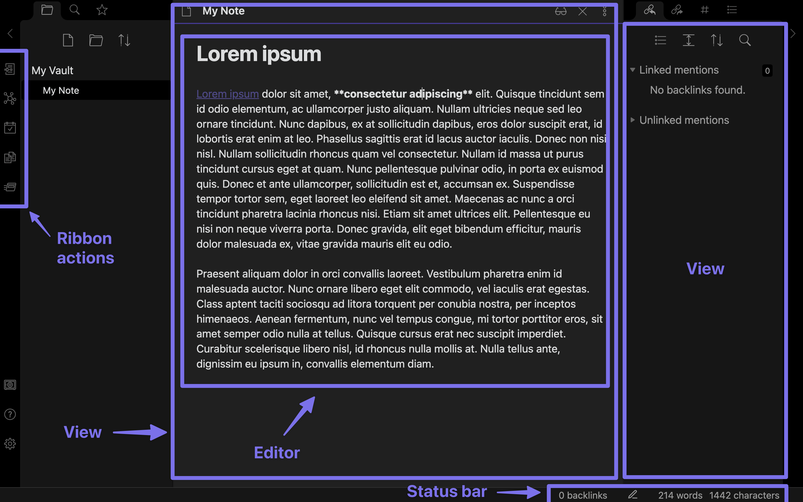

이 페이지는 Obsidian 사용자 인터페이스를 추가하거나 변경하는 방법에 대한 개요를 제공합니다.

Obsidian을 처음 열면 일부 사용자 인터페이스 구성 요소를 볼 수 있습니다.

- [[Ribbon actions]]
- [[Views]]
- [[Plugins/User interface/Status bar|Status bar]]

에디터를 수정하려면 [[Editor]] 및 [[Editor extensions]]를 참조하세요.

